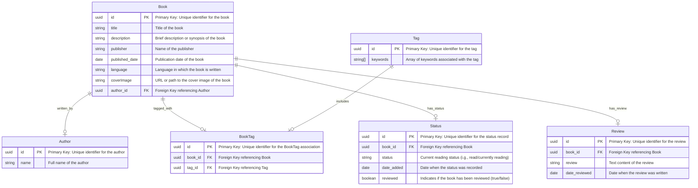

# Bookshelf API Documentation

## Installation

Install dependencies:

```sh
bun install
```

Run:

```sh
bun dev
```

<http://localhost:3000>

## Endpoints

### API Specification

#### Books

| Endpoint     | HTTP     | Description         |
| ------------ | -------- | ------------------- |
| `/books`     | `GET`    | Get all books       |
| `/books/:id` | `GET`    | Get a book by ID    |
| `/books`     | `POST`   | Add a new book      |
| `/books/:id` | `PATCH`  | Update a book by ID |
| `/books/:id` | `DELETE` | Delete a book by ID |
| `/books`     | `DELETE` | Delete all books    |

#### Authors

| Endpoint       | HTTP     | Description            |
| -------------- | -------- | ---------------------- |
| `/authors`     | `GET`    | Get all authors        |
| `/authors/:id` | `GET`    | Get an author by ID    |
| `/authors`     | `POST`   | Add a new author       |
| `/authors/:id` | `PATCH`  | Update an author by ID |
| `/authors/:id` | `DELETE` | Delete an author by ID |

#### Tags

| Endpoint    | HTTP     | Description        |
| ----------- | -------- | ------------------ |
| `/tags`     | `GET`    | Get all tags       |
| `/tags/:id` | `GET`    | Get a tag by ID    |
| `/tags`     | `POST`   | Add a new tag      |
| `/tags/:id` | `PATCH`  | Update a tag by ID |
| `/tags/:id` | `DELETE` | Delete a tag by ID |

#### BookTags

| Endpoint                  | HTTP     | Description                     |
| ------------------------- | -------- | ------------------------------- |
| `/books/:id/tags`         | `GET`    | Get tags associated with a book |
| `/books/:id/tags`         | `POST`   | Add a tag to a book             |
| `/books/:id/tags/:tag_id` | `DELETE` | Remove a tag from a book        |

#### Status

| Endpoint            | HTTP     | Description                         |
| ------------------- | -------- | ----------------------------------- |
| `/books/:id/status` | `GET`    | Get the reading status of a book    |
| `/books/:id/status` | `POST`   | Add or update the status of a book  |
| `/books/:id/status` | `PATCH`  | Update the reading status of a book |
| `/books/:id/status` | `DELETE` | Remove the status for a book        |

#### Reviews

| Endpoint                  | HTTP     | Description                 |
| ------------------------- | -------- | --------------------------- |
| `/books/:id/reviews`      | `GET`    | Get reviews for a book      |
| `/books/:id/reviews/:rid` | `GET`    | Get a review by its ID      |
| `/books/:id/reviews`      | `POST`   | Add a new review for a book |
| `/books/:id/reviews/:rid` | `PATCH`  | Update a review by ID       |
| `/books/:id/reviews/:rid` | `DELETE` | Delete a review by ID       |

|

## ERD

