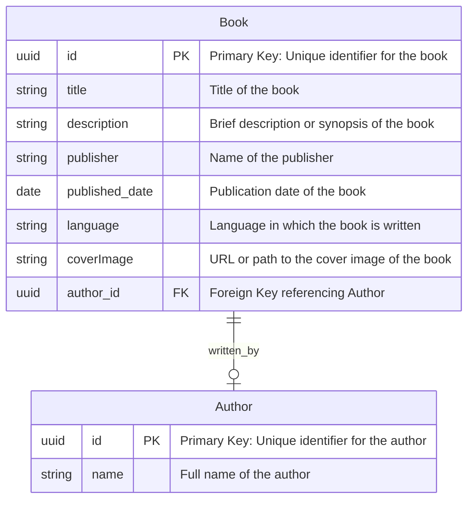

# Bookshelf API Documentation

## Installation

Install dependencies:

```sh
bun install
```

Run:

```sh
bun dev
```

## Configuration

.env.example :   
  
DATABASE_URL=  
POSTGRES_USER=  
POSTGRES_PASSWORD=  


## Testing

```sh

hurl --test --verbose --variable host=[HOST_NAME] test/. > test/logs/(date "+%Y-%m-%d_%H-%M-%S").txt 2>&1

```

<http://localhost:3000>

## Endpoints

### API Specification

#### Books

| Endpoint     | HTTP     | Description         |
| ------------ | -------- | ------------------- |
| `/books`     | `GET`    | Get all books       |
| `/books/:id` | `GET`    | Get a book by ID    |
| `/books`     | `POST`   | Add a new book      |
| `/books/:id` | `PATCH`  | Update a book by ID |
| `/books/:id` | `DELETE` | Delete a book by ID |

#### Authors

| Endpoint       | HTTP     | Description            |
| -------------- | -------- | ---------------------- |
| `/authors`     | `GET`    | Get all authors        |
| `/authors/:id` | `GET`    | Get an author by ID    |
| `/authors`     | `POST`   | Add a new author       |
| `/authors/:id` | `PATCH`  | Update an author by ID |
| `/authors/:id` | `DELETE` | Delete an author by ID |

## ERD


